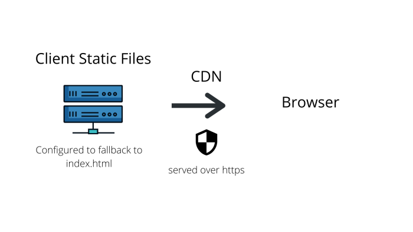
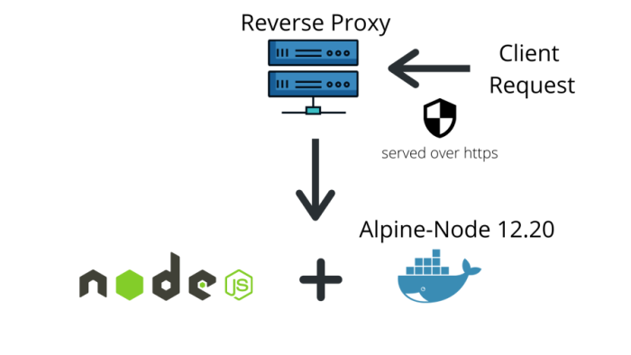

# Khateeb Remind System Design Document

# Purpose

The purpose of this document is to explain the systen design of Khateeb Remind and some reasons for many of the design desicions. It should aid anyone wanting to replicate the app or contribute to the project in understanding the project on a deeper level.

## Table of Contents

* [Project Stack](#project-stack)
* [Notes on Project Structure](#notes-on-project-structure)
* [Environmental Variables](#environmental-variables)
* [Authorization Across the App](#authorization-across-the-app)
* [Reasons for using Vue](#reasons-for-using-vue)
* [Web App Routing](#web-app-routing)
* [Client Side 'Runtimes'](#client-side-runtimes)
* [Progressive Web App Testing](#progressive-web-app-testing)
* [Offline Mode](#offline-mode)
* [Client Side Issues](#client-side-issues)
* [Client Side Configurations](#client-side-configurations)
* [Reasons for Using Node](#reasons-for-using-node)
* [Server Side Controllers](#server-side-controllers)
* [About Database and Schemas](#about-database-and-schemas)
* [The Nefarious Notification Loop](#the-nefarious-notification-loop)
* [About Notifications and Third Party Services](#about-notifications-and-third-party-services)
* [Server Side Configurations](#server-side-configurations)
* [Server Initialization](#server-initialization)
* [Dev-Ops Suggestions](#dev-ops-suggestions)
* [Closing Notes](#closing-notes)

# Project Stack

## Client (Frontend) - Javascript
* Vuejs - javascript framework
  * Vue router - for routing
  * Vuex - for state management
  * Vue PWA Plugin - useful library for creating PWAs with vue

### Build Tools
* Webpack - module bundler
* SASS - CSS preprocessor
* Babel - javascript transpiler

### Development Tools
* Serve - a javascript library for running webservers (used for testing PWA)
* ESLint - a linting tool
* VueCLI - managing webpack, dev server, etc.

## Server (Backend) - Javascript
* Expressjs - a node server framework
* Docker - for containerization

### Database
* MongoDB - a NoSQL database
* Mongoose - a mongoDB middleware for node

### Software Development Kits (SDKs)
* Amazon Web Services (AWS) client s3 - a library for uploading files to the cloud
* AWS client SES - a library for sending emails

### Development Tools
* Nodemon - hot reload of server

## Testing
* Unit-testing: Jest
* Integration-testing: Jest
* End-to-End: Cypress

# Notes on Project Structure

## Libraries
All custom client and server libraries are found in the "libraries" folder at the root folder of each respective project. In general, each library will include two files:

* main.js  
* helpers.js 

The "main.js" file repersents the library's public interface which is meant to be used. The "helpers.js" repersents the libraries private interface and backend implementations, which are NOT intended to be used, but serve only as implementation details for the public interface.

There a few libraries that stray from this rule, such as the "requests" client library. Usually these libraries will be compilation of sub-libraries which follow the convention mentioned above or will be a single file will are meant to be a public interface such as the "globalUtilities.js" client and server libraries.

Also on the server side there is a "middleware" folder, which essentially is a library, but I felt as if the distinction was helpful for distinguishing between general libraries and one's that are only used as API middleware.

## App and Server Entry points
The client entry point is found in the src folder and is name "App.js", while the entrypoint Vue instance is called "Main.vue".

The server entry point is called "Server.js" and is found in the root folder of the server.

## Config Files
As a general rule all configuration files are found in the root folder of each project. The only exception to this is the "icon.config.js" client configuration file which is found in the src folder of the client.

On the client side the "App.config.js" file found in the root folder is simply a compilation of neccessary environmental variables and configurations that are specific to the Khateeb Remind client. The "globalConfig" object is globally imported across the entire web-app via Vue prototyping.

On the server side the "Server.config.js" file found in the root folder servers the same purpose as "App.config.js" on the client. For obvious reasons the environmental variables for the server side are not included in this public repository, but you can recreate the .env file for both production and development by finding all the "process.env" references in the "Server.config.js" file.

## Global Variables and Functions
Each project has it's own global variables and functions. Any global configurations are found in either "App.config.js" or "Server.config.js" depending on the project. Any other global variables are found in the entry point for each respective app. 

Global variables are prepended by _ in the client app. This convention was chosen to avoid namespace conflicts with Vue's reserved properties which are prepend with "$". Variables are:

* \_api: all api requests
* \_utils: useful utility functions
* \_config: global app configurations 

On the server side global variables are prepended by "$", and are attached to the global Node object. Variables are:

* $rootDir: absolute path to the project's root directory
* $config: global server configurations
* $utils: useful utility functions
* $db: a reference to a list of all database models

## NPM scripts
The README files at the root of the client and server provide brief explantions of the npm scripts for each respective project.

# Environmental Variables

## Client
Both development and production:
* VUE_APP_API_SERVER_URL <String> - your API url
* VUE_APP_INITIATE_OFFLINE_MODE_FAIL_REQUEST_COUNT <Number> - the amount of failed requests (timed-out or no server response) before initiating offline mode
* VUE_APP_MAX_NOTIFICATION_LOOP_RUN_COUNT_FOR_WEEK <Number> - the maximum amount of times an administrator can run the [notification loop](#the-nefarious-notification-loop) in a week across all jummahs before disabling it
* VUE_APP_MAX_NOTIFICATION_LOOP_RUN_COUNT_INDIVIDAUL_JUMMAH <Number> - the maximum amount of times an administrator can run the [notification loop](#the-nefarious-notification-loop) for one particular jummah before disabling it
* VUE_APP_DEFAULT_IO_LOADING_TIME <Number> - the default time (in milliseconds) the loading overlay screen is visible when page requires AJAX call on creation
* VUE_APP_DEFAULT_AUTH_IO_LOADING_TIME <Number> - the default time (in milliseconds) the loading icon appears for when authorization key (json web token) change is requested

## Server
Both development and production:
* EMERGENCY_KEY - used for API emergencies
* JWT_SECRET - used to sign JWTs
* DATABASE - URI to a MongoDB
* DEFAULT_ROOT_PASS - the default password for the root user
* DEFAULT_TEST_USER_PASS - the default password for test users
* VAPID_PUBLIC_KEY - public key for vapid, used on client side to get PWA subscription; generated by web-push library (included with package)
* VAPID_PRIVATE_KEY - private key for vapid, used on server side to send PWA push notifications; generated by web-push library (included with package)
* VAPID_SUBJECT_FIELD - your contact information for push services, in case of emergencies (like your notifications not being pushed, compromised credentials, etc.)

If using default third party cloud storage and email service (Amazon Web Services), you'll also need:
* AWS_HOSTING_REGION - region of hosting
* AWS_S3_ACCESS_KEY - aws security key
* AWS_S3_ACCESS_ID - aws security identification
* AWS_SES_EMAIL - name email that sends email notifications
* AWS_S3_BUCKET_NAME - bucket name of cloud storage

# Authorization Across the App

The client and server use the same authorization system to give access to resources. User types are mapped to an authorization level (integer).

| User Type  | Authorization Level | User Description |
| ------------- | ------------- | ------------|
| User Not Logged In | 0 | This user can be someone who has just landed on the website for the first time or a user who hasn't logged in yet |
| \*\*User Logged In Without a Specialized Authoization Key  | 1 | User who has an account and is logged in but isn't currently carrying the authorization key for any particular institution or role |
| Khateeb | 2 | Someone who gives Friday Khutbahs (sermons) |
| Institution Administrator | 3 | Someone who helps schedule khateebs at an institution |
| Root Institution Administrator | 4 | The leader (aka user with highest authority) of an institution; has unrestricted permissions |
| \*System Administrator | 5 | Someone who helps adminster the entire Khateeb Remind System |
| \*Root System Administrator | 6 | The user with the highest authentication across the whole system; has unrestricted permissions |

\* Special user type - any user who holds this authorization can only hold this authorization and will NOT be allowed to hold any other authorization.

** A specialized authorization key is just a key that indicates whether the current user is logged in as special user or logged into an institution. Any user can hold multiple specialized authorization keys (unless they are a special user) and before they want enter into any institution they are considered a "generic" user who cannot view any information related to institutions.

## Authorization Method
Khateeb Remind uses JWTs (json web tokens) to verify user identity. JWTs can hold up to 6 properties in the payload (implying that every JWT payload is an object), with only two attributes being mandatory:

* \_id: the user's identification hast
* __t: the user's type
* institutionID (optional): which institution are they logged into
* authId (optional): if logged into institution, what is their authorization reference (read more about this in the [schemas section](#about-database-and-schemas))
* SpecialStatus (optional): is the user as special user type
* specialInstitution (optional): reserved for special user type

Authorization is required to be in the request header in order to access API resources. JWT Token from last login is automatically stored in local storage on the client-side.

## On Header Mutations
If you look into the source code, you'll find that once a user is authenticated and their token deemed acceptable, a middleware then mutates (by appending) the incoming request header to include information about the incoming user based on the above mentioned JWT attributes. If JWT's attribute isn't present the header is either not included or recorded as undefined. Information includes: 

* institutionid --> JWT.institutionID or undefined
* userid: usertype --> JWT.__t
* targetusermodel --> derived from JWT.__t
* specialStatus --> JWT.specialStatus or not included at all
* specialInstitution --> JWT.specialInstitution or "default"
* authLevel --> derived from JWT.__t

## Client-side Authorization
The client-side app doesn't do any REAL authentication but relies on the server to do so for it. This posses no obvious security threat (as far as I can see, but I might be wrong) because the user cannot access any information without first requesting from the server. If the server returns a 401 (unauthorized) or 403 (forbidden) status code, the app will then either direct the user back to a page they have authorization to see and alert them that they are unauthorized to view the page they are on.

It is important to note that if a user tries to access a view (webpage) that requires a higher authorization level than their JWT claims they have the web-app will take preventative measures and not allow the user to direct to that pages. Unfortunately becauase the client app always assumes that the JWT has not been forged, a user *could* theortically forge their own JWT and add a higher level of authorization to the payload - which would allow them to see views that require higher authorization. But again the server would ideally detect something like this and the view wouldn't recieve any information from the server. 

# Reasons for using Vue

todo

# Web App Routing

todo

# Client Side Runtimes

todo

# Progressive Web App Testing

todo

# Offline Mode

todo

# Client Side Issues

todo

# Client Side Configurations

All these configurations are found in the *"App.config.js"* file found in the root folder of the client. All configurations are immutable and can only be changed by directly editing the file.

## Network - Everything related to Ajax calls and IO
* serverURL: an alias for [VUE_APP_API_SERVER_URL environmental variable](#environmental-variables)
* offlineModeRequestCountThreshold: a casted-to-number version of [VUE_APP_INITIATE_OFFLINE_MODE_FAIL_REQUEST_COUNT environmental variable](#environmental-variables)
* pwaTestingServerURL: a url to the server endpoint to be used during PWA testing
* defaultIOLoadingTime: a casted-to-number version of [VUE_APP_DEFAULT_IO_LOADING_TIME environmental variable](#environmental-variables)
* defaultAuthIOLoadingTime: a casted-to-number version of [VUE_APP_DEFAULT_AUTH_IO_LOADING_TIME environmental variable](#environmental-variables)

## Security - All matters related to client side security
* vapidPublicKey - a copy of the public vapid key produced by the server, same value as [VAPID_PUBLIC_KEY environmental variable](#environmental-variables). This is not an alias for that value though, as this must be inputted manually at the present time.

## Third Party Services
* feedbackFormURL - a url to external feedback form for Khateeb Remind

## User Restrictions - any client side restrictions the web-app artifically puts on users
* notificationLoopMaxRunCountPerWeek: an alias for [VUE_APP_MAX_NOTIFICATION_LOOP_RUN_COUNT_FOR_WEEK environmental variable](#environmental-variables)
* notificationLoopMaxRunCountPerJummah: an alias for [VUE_APP_MAX_NOTIFICATION_LOOP_RUN_COUNT_INDIVIDAUL_JUMMAH environmental variable](#environmental-variables)

## Global - configurations that are imported into every Vue instance
* nullId - the canonical value for a null id, usually when used when foreign key reference is empty

## Router - all settings related to the Vue-router
* animationName - the page transition animation choosen for the web app. For all other options check out the [vue-page-transition package](https://www.npmjs.com/package/vue-page-transition)

## PWA - configurations related to the progressive web functionality
* reloadDelayAfterNewServiceWorkerDetected - delay in seconds before reload is initated when new service worker is detected. Essentially the reload allows for the new service worker to take control of the webpage and thereby add any new content to the website code.

# Reasons for Using Node

todo

# Server Side Controllers

todo

# About Database and Schemas

todo

# The Nefarious Notification Loop

todo

# About Notifications and Third Party Services

todo

# Server Side Configurations

All these configurations are found in the *"Server.config.js"* file found in the root folder of the client. All configurations are immutable and can only be changed by directly editing the file.

## Global - configurations accessible from all files
* rootInstitution - this is a sort of fake institution reserved for the [special user types](#authorization-across-the-app) so that the web-application can treat them exactly like normal users.
* cron.timezone - the timezone all cron jobs are referenced against if the timezone options is set to true.
* consts.* - these are variables that used across the server for consistency
* customHeaders.* - headers that are not part of the HTTP request spec and are specific to Khateeb Remind.
* notifications.automatedNotificationSignature - signature of any message that is sent by Khateeb Remind.

## Database
* mongoose.* - options for the MongoDB ODM mongoose - khateeb remind's chosen MongoDB middleware
* URI - the URI to database, where it's hosted locally or on another machine

## Initialization
All explanation is provided in the [section below](#server-initialization)

## Security - all configurations related to Khateeb Remind Security
* jwtSecret - an alias for [JWT_SECRET environmental variable](#environmental-variables)
* thirdPartyServices.AWSAuthCredentials.region - an alias for [AWS_HOSTING_REGION environmental variable](#environmental-variables)
* thirdPartyServices.AWSAuthCredentials.credentials.secretAccessKey - an alias for [AWS_S3_ACCESS_KEY environmental variable](#environmental-variables)
* thirdPartyServices.AWSAuthCredentials.credentials.accessKeyId - an alias for [accessKeyId environmental variable](#environmental-variables)
* vapid.subject - an alias for [VAPID_SUBJECT_FIELD environmental variable](#environmental-variables)
* vapid.publicKey - an alias for [VAPID_PUBLIC_KEY environmental variable](#environmental-variables)
* vapid.privateKey - an alias for [VAPID_PRIVATE_KEY environmental variable](#environmental-variables)

## Third Party Services
* AWS.email - an alias for [AWS_SES_EMAIL environmental variable](#environmental-variables)
* AWS.cloudStorageBucketName - an alias for [AWS_S3_BUCKET_NAME environmental variable](#environmental-variables)
* AWS.cloudSubDirectories.* - where all cloud storage folders are specified

## Network - All configurations related to incoming requests from client
* port - which TCP port is the server listening on
* maxJSONSize - maximum size a request can be (default metric is in megabytes)

# Server Initialization

todo

# Dev Ops Suggestions

Because the Khateeb Remind Client App is a PWA it is required to served over a secure protocol (https) in order to function properly. It's also important to note that the server that is meant to serve the client app to requesting browsers must be configured to fallback to the file "index.html". This because the Vue-router is meant to handle routing but cannot do so unless all requests for static files are ultimately directed to the the Vue-app entry point.

Since the docker image is already ready to go, it's recommended that you just use the docker file at the root of the server to build an image. Then host the image on a virtual machine and put infront of it a reverse-proxy of some kind - which serves traffic over https. It is highly-recommended for the server to be served over secure traffic because the client needs to be served over secure traffic - to function properly (due to service worker). If you intend to use insecure protocols (such as http) to fulfill server requests be aware that the client must also use an insecure protocol or all ajaz calls will be blocked by most browsers.

# Closing Notes

* Using some kind of statically-typed language on the server-side would have been very useful. Although this would have slowed down development speed slightly, it would have lead to better documentation and type saftey at runtime. Typescript or another language entirely, such as Rust, Go, C## etc would have been viable options.
* Using both ES6 Classes and Factory functions to initalize JavaScript objects, made the code a little confusing to follow and could have been avoided by choosing one method and sticking with it.
* Using an SQL or graph database would have probably been a better fit for Khateeb Remind instead of mongoDB. As the whole project started to grow in size the data only became more relation-oriented, which definintely in NOT the strength of Mongo in terms of performance or database interaction. Although MongoDB has an interface equivalent to SQL's "JOIN" (not exactly but close enough), it is neither as performant, intutive, or as well-documented as the SQL alternative.
* The authentication system should be more loosely coupled than it is right now. Instead of having hard-coded roles, it would have been better for the authorization to be based on read, write, modify, and delete permission for specific resources (eg. announcements). This would have lead to a more flexible, and powerful authorization system. 

